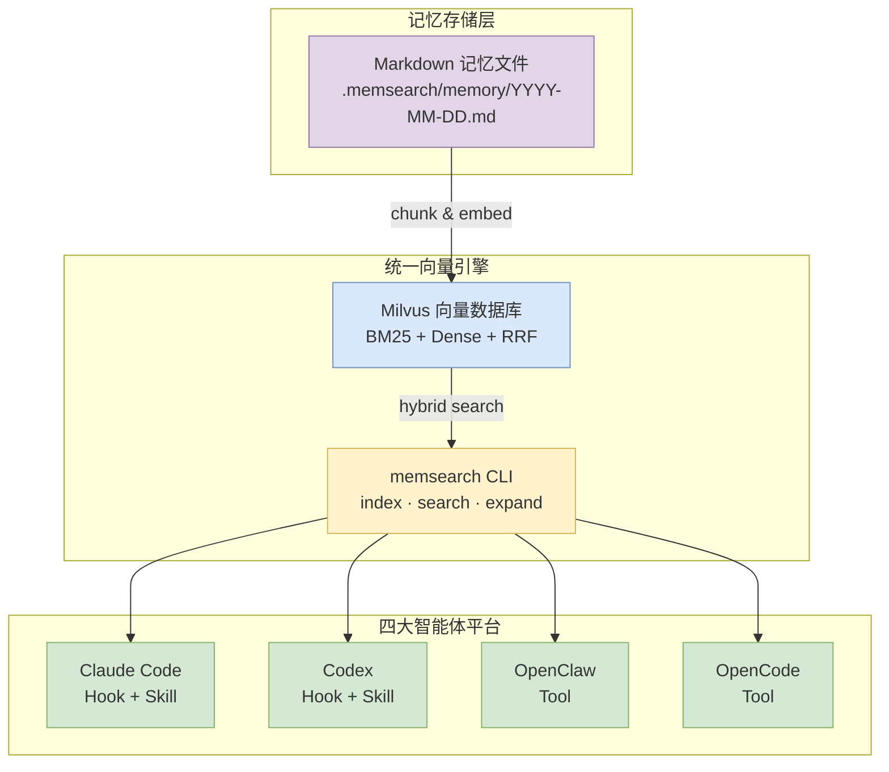

[memsearch](https://github.com/zilliztech/memsearch) 是一款基于Milvus向量数据库的语义记忆搜索引擎。它的核心设计理念是将markdown文件作为事实源，Milvus中的向量只是一个可以根据markdown文件重新构建的影子索引(shadow index)。memsearch会对markdown文件构成的知识库进行切片(chunk)，向量嵌入(embed)，储存，然后通过混合搜索的方式抽取记忆。它可以将你的OpenClaw、Claude Code等智能体的长期记忆存储在相同的地方，从而无缝使用不同的智能体一起完成工作。关于记忆系统的总体工作原理，可以参考我的另一篇文章[智能体与记忆体概述](/posts/agents-and-memory-systems)。

## 快速上手使用

在了解memsearch的实现细节之前，先在Claude Code中安装使用，了解它的表现和作用是一个非常好的学习方法。在Claude Code中只需要下面两行命令就可以完成安装了。

```bash
/plugin marketplace add zilliztech/memsearch
/plugin install memsearch
```

随后你和Claude Code的所有对话都会自动触发memsearch，它会根据每天的日期自动提取记忆存储到`.memsearch/memory/`目录下。比如你想查看今天的记忆内容，就可以用下面的命令打印出来。

```bash
cat .memsearch/memory/$(date +%Y-%m-%d).md
```

配置就是如此简单，memsearch作为一个插件会通过Claude Code hooks自动触发，每次你和Claude Code交互时，它会自动地进行记忆构建、演进和抽取。

## MemSearch供智能体调用的接口

MemSearch的设计初衷之一是**让不同智能体共享同一套记忆系统**。无论是Claude Code、OpenClaw、OpenCode还是Codex，它们都使用相同的底层存储（`.memsearch/memory/*.md`）和相同的向量引擎（Milvus），只是通过各自平台的插件机制接入。本节剖析这套跨平台统一接口的设计。

### 四个平台的插件架构对比

```
┌─────────────────────────────────────────────────────────────────────────────┐
│                        跨平台插件架构对比                                    │
├─────────────────┬──────────────┬──────────────┬──────────────┬──────────────┤
│                 │ Claude Code  │ OpenClaw     │ OpenCode     │ Codex        │
├─────────────────┼──────────────┼──────────────┼──────────────┼──────────────┤
│ 存储格式         │ JSONL        │ JSONL        │ SQLite       │ JSONL        │
│ Hook机制        │ Shell脚本    │ JS API       │ TypeScript   │ Shell脚本    │
│ 摘要生成        │ claude -p    │ openclaw agent│ opencode prompt│ codex exec  │
│ 上下文注入      │ SessionStart │ before_agent │ system.trans │ session-start│
│ Skill上下文     │ context:fork │ N/A          │ N/A          │ N/A          │
│ 技能调用方式    │ /memory-recall│ /memory-recall│ !memory-recall│ $memory-recall│
│ 工具注册        │ Skills系统   │ LLM工具调用  │ LLM工具调用  │ 技能系统     │
└─────────────────┴──────────────┴──────────────┴──────────────┴──────────────┘
```

尽管实现各异，四个平台共享相同的**三层架构**：

```
┌─────────────────────────────────────────────────────────────────────────────┐
│                         统一三层架构                                       │
│                                                                          │
│  ┌─────────────────────────────────────────────────────────────────────┐ │
│  │ Layer 1: 记忆生成（Capture）                                          │ │
│  │                                                                       │ │
│  │ 对话轮次完成 → 解析转录 → LLM生成摘要 → 保存到 .memsearch/memory/   │ │
│  │                                                                       │ │
│  │ 各平台实现差异：                                                      │ │
│  │   • Claude Code/Codex: Shell脚本 + claude -p / codex exec            │ │
│  │   • OpenClaw: JS API + 内置agent生成摘要                            │ │
│  │   • OpenCode: TypeScript hook + opencode prompt                      │ │
│  └─────────────────────────────────────────────────────────────────────┘ │
│                                 │                                        │
│                                 ▼                                        │
│  ┌─────────────────────────────────────────────────────────────────────┐ │
│  │ Layer 2: 向量索引（Index）                                           │ │
│  │                                                                       │ │
│  │ markdown文件 → chunk_markdown() → embed() → Milvus upsert            │ │
│  │                                                                       │ │
│  │ 所有平台共用：                                                        │ │
│  │   • 相同的chunk算法（标题边界 + 段落切割）                            │ │
│  │   • 相同的memsearch CLI（统一入口）                                  │ │
│  │   • 相同的混合搜索流程（BM25 + dense + RRF）                         │ │
│  └─────────────────────────────────────────────────────────────────────┘ │
│                                 │                                        │
│                                 ▼                                        │
│  ┌─────────────────────────────────────────────────────────────────────┐ │
│  │ Layer 3: 记忆检索（Recall）                                          │ │
│  │                                                                       │ │
│  │ 用户提问 → 语义搜索 → 展开 → 深度钻取                                │ │
│  │                                                                       │ │
│  │ 各平台调用方式差异：                                                  │ │
│  │   • Claude Code: memory-recall技能（context:fork子代理）              │ │
│  │   • OpenClaw: memory_search/memory_get/memory_transcript工具         │ │
│  │   • OpenCode: memory_search/memory_get/memory_transcript工具          │ │
│  │   • Codex: $memory-recall技能                                         │ │
│  └─────────────────────────────────────────────────────────────────────┘ │
└─────────────────────────────────────────────────────────────────────────────┘
```

### 共享的核心组件

#### 1. 统一的Summarizer提示词

所有平台共用同一份`summarize.txt`（位于`plugins/_shared/prompts/summarize.txt`），确保跨平台的记忆风格一致：

```markdown
You are a third-person note-taker. You will receive a transcript of ONE
conversation turn between a human and {{AGENT_NAME}}.

Your job is to record what happened as factual third-person notes.
Output 2-6 bullet points, each starting with '- '.
Write in third person: 'User asked...', '{{AGENT_NAME}} read file X'
```

**关键设计**：将`{{AGENT_NAME}}`替换为具体平台名称（"Claude Code"、"OpenClaw"等），使同一提示词适配所有平台。

#### 2. 统一的Collection派生算法

每个项目有独立的Milvus collection，通过`derive-collection.sh`从项目路径生成唯一名称：

```bash
# derive-collection.sh 的核心逻辑
PROJECT_DIR="$1"
COLLECTION_NAME="memsearch_$(echo "$PROJECT_DIR" | sha256sum | cut -c1-16)"
```

这确保：
- 同一项目在不同智能体间共享记忆（相同的collection）
- 不同项目隔离（不同的collection）

#### 3. 统一的记忆文件格式

所有平台遵循相同的markdown格式：

```markdown
# 2026-03-25

## Session 14:47

### 14:47
<!-- session:UUID turn:UUID transcript:PATH -->
- User asked about the authentication flow
- Claude read auth.ts and identified JWT token issues
- Claude proposed OAuth2 as the replacement solution
```

**HTML注释锚点**是跨平台追溯的关键：
- `session:UUID` — 标识会话
- `turn:UUID` — 标识对话轮次
- `transcript:PATH` — 指向原始转录文件

#### 4. 统一的向量存储

```python
# 所有平台共用 MilvusStore（store.py）
class MilvusStore:
    # 相同的collection schema
    # 相同的混合搜索实现
    # 相同的chunk ID生成算法
```

这意味着：**Markdown是唯一事实源，向量只是可重建的影子索引**。任何平台保存的记忆，都可以被其他平台检索到。

### 平台差异的具体实现

#### Claude Code vs Codex：相似的Shell Hook架构

```bash
# Claude Code 和 Codex 都使用Shell脚本作为Hook
# plugins/claude-code/hooks/
# plugins/codex/hooks/
# 共享相同的 common.sh 工具函数库

# 主要差异：
# • Claude Code: ${CLAUDE_PLUGIN_ROOT} 环境变量
# • Codex: ${CODEX_HOOK_DIR} 环境变量
# • Claude Code的stop hook通过claude -p生成摘要
# • Codex的stop hook通过codex exec LLM生成摘要
```

#### OpenClaw vs OpenCode：工具调用而非技能

```python
# OpenClaw/OpenCode注册三个LLM工具（而非技能）
tools = [
    "memory_search",     # memsearch search
    "memory_get",        # memsearch expand
    "memory_transcript" # transcript.py
]
```

这与Claude Code的`context:fork`技能不同——工具直接暴露给主代理，而不是fork子代理。

#### OpenCode的特殊性：SQLite存储

```
OpenCode使用SQLite存储对话历史（而非JSONL）：
~/.local/share/opencode/opencode.db

记忆文件中的HTML锚点格式不同：
<!-- session:SESSION_ID db:~/.local/share/opencode/opencode.db -->

OpenCode的capture-daemon.py负责：
1. 轮询SQLite数据库
2. 提取新对话轮次
3. 写入markdown记忆文件
```

### 跨平台记忆共享的边界

虽然底层存储共享，但**智能体特定的元数据不同**：

```markdown
# Claude Code记忆（JSONL转录）
<!-- session:2026-05-07--10-30-00 turn:01JX... transcript:/path/to/transcript.jsonl -->

# OpenClaw记忆（JSONL转录）
<!-- session:UUID transcript:~/.openclaw/agents/main/sessions/UUID.jsonl -->

# OpenCode记忆（SQLite转录）
<!-- session:SESSION_ID db:~/.local/share/opencode/opencode.db -->

# Codex记忆（JSONL转录，但格式为rollout而非transcript）
<!-- rollout:UUID db:... -->
```

**关键洞察**：各平台都保留`session`/`turn`级别的锚点，但指向不同格式的转录文件。`memsearch expand`命令会解析HTML锚点，根据平台类型读取相应的转录文件。

### 总结：为什么统一接口重要



**这种设计的价值**：
1. **数据可移植性**：删除插件不丢失记忆，只是停止自动捕获
2. **跨智能体协作**：Claude Code处理的记忆，OpenClaw/OpenCode/Codex都可以检索
3. **向量索引幂等**：markdown可重建索引，无需维护状态

**这是"markdown-first"哲学的技术体现**——平台千变万化，但记忆的本质（markdown文本）和检索引擎（memsearch + Milvus）保持统一。


## Claude Code插件工作原理

MemSearch通过Claude Code的[插件系统](https://code.claude.com/docs/en/plugins)接入智能体的生命周期，利用四个核心Hooks在恰当的时机自动完成记忆的捕获、索引和检索。

### 插件架构概览

MemSearch的Claude Code插件位于`plugins/claude-code/`，其核心文件结构如下：

```
plugins/claude-code/
├── hooks/
│   ├── common.sh          # 共享工具函数（JSON解析、memsearch检测等）
│   ├── hooks.json         # Hook配置：4个生命周期钩子
│   ├── session-start.sh   # 会话启动钩子
│   ├── user-prompt-submit.sh  # 用户提交提示钩子
│   ├── stop.sh            # 停止钩子（核心记忆生成）
│   └── session-end.sh     # 会话结束钩子
├── prompts/
│   └── summarize.txt      # 记忆摘要生成提示词
├── skills/
│   └── memory-recall/    # 拉取式记忆检索技能
│       └── SKILL.md
├── transcript.py         # JSONL转录文件解析器
└── scripts/
    └── derive-collection.sh  # 生成项目级collection名称
```

### 四个核心Hooks

#### 1. SessionStart：初始化与上下文注入

当Claude Code启动新会话时，`session-start.sh`会执行以下操作：

```bash
# 自动安装memsearch（如果缺失）
if ! command -v memsearch &>/dev/null; then
    curl -LsSf https://astral.sh/uv/install.sh | sh
    uvx --upgrade --from 'memsearch[onnx]' memsearch
fi

# 首次使用：默认ONNX provider（免API Key）
if [ ! -f "$HOME/.memsearch/config.toml" ]; then
    memsearch config set embedding.provider onnx
fi

# 启动watch或执行一次性索引
start_watch   # Server模式（Milvus HTTP/TCP）
# 或
memsearch index "$MEMORY_DIR"  # Lite模式（本地.db）
```

同时，它会将最近两天的记忆标题和要点注入到会话上下文中，让Claude一启动就知道最近在做什么项目。

#### 2. UserPromptSubmit：信号注入，按需触发

这个钩子是整个"推-拉混合"模式的核心体现，但它的行为远比表面看起来微妙。

**实际执行逻辑**（`user-prompt-submit.sh`）：

```bash
# 1. 读取用户输入（JSON格式，通过stdin传入）
PROMPT=$(_json_val "$INPUT" "prompt" "")

# 2. 过滤短提示（<10字符跳过，减少噪音）
if [ -z "$PROMPT" ] || [ "${#PROMPT}" -lt 10 ]; then
  echo '{}'   # 不注入任何内容
  exit 0
fi

# 3. 检查memsearch是否可用
if [ -z "$MEMSEARCH_CMD" ]; then
  echo '{}'
  exit 0
fi

# 4. 注入信号
echo '{"systemMessage": "[memsearch] Memory available"}'
```

**关键点：hook本身并不执行任何搜索或存储操作**。它只做一件事——在Claude处理用户消息之前，向其上下文中注入一个信号字符串。实际的向量搜索发生在后续的`memory-recall`技能调用中。

**触发时机与流程**：

```
用户发送消息
    │
    ▼
┌─────────────────────────────────────────────────────────────────┐
│  UserPromptSubmit hook 触发（此时Claude还未处理这条消息）         │
│                                                                  │
│  输入：用户消息JSON { prompt: "之前我们决定用什么方案来着？" }    │
│  输出：{ "systemMessage": "[memsearch] Memory available" }      │
│                                                                  │
│  注意：hook本身不调用memsearch search                            │
└─────────────────────────────────────────────────────────────────┘
    │
    ▼
Claude收到：用户消息 + systemMessage信号
    │
    ▼
┌─────────────────────────────────────────────────────────────────┐
│  Claude决定是否调用 memory-recall 技能                            │
│                                                                  │
│  触发条件（由SKILL.md描述）：                                      │
│  - 用户问题涉及历史上下文（"之前我们决定..."、"为什么..."）        │
│  - 看到 "[memsearch] Memory available" 信号                       │
│                                                                  │
│  跳过条件：                                                       │
│  - 问题只涉及当前代码状态（用Read/Grep即可）                      │
│  - 问题是一次性的临时任务                                         │
│  - 用户明确要求忽略记忆                                           │
└─────────────────────────────────────────────────────────────────┘
    │
    ▼（如果决定调用）
┌─────────────────────────────────────────────────────────────────┐
│  memory-recall 技能作为 FORKED AGENT 运行（context: fork）        │
│                                                                  │
│  技能内部：                                                        │
│  1. memsearch search "<query>" --top-k 5 --json-output          │
│  2. memsearch expand <chunk_hash> (可选)                        │
│  3. transcript.py --turn <uuid> --context 3 (可选深度钻取)       │
│                                                                  │
│  技能输出：结构化的记忆摘要，返回给主对话上下文                    │
└─────────────────────────────────────────────────────────────────┘
```

**context: fork的含义**：memory-recall技能运行在一个独立的子上下文中，它的搜索结果会被合并回主对话。这避免了搜索结果污染主对话的上下文——如果记忆不相关，Claude可以忽略它而不影响主任务。

**这是一种"机会型"记忆检索**：不是每次都强制搜索历史（那样会造成大量无关的上下文干扰），而是在Claude检测到用户可能需要历史上下文时，才通过技能按需拉取。

#### 3. Stop：记忆生成的核心

当用户结束会话（按`q`退出）时，`stop.sh`执行完整的记忆生成流程：

```
┌─────────────────────────────────────────────────────────────┐
│  1. 解析JSONL转录文件 → 提取最后一次对话轮次                  │
│         ↓                                                   │
│  2. 调用 `claude -p` 生成第三人称摘要（2-6个要点）           │
│         ↓                                                   │
│  3. 追加到今天的记忆文件（.memsearch/memory/YYYY-MM-DD.md）  │
│         ↓                                                   │
│  4. 立即执行 memsearch index 更新向量索引                    │
└─────────────────────────────────────────────────────────────┘
```

**关键设计**：只保存最后一次对话轮次，而不是整个会话。这样既能捕捉用户意图和关键操作，又避免记忆文件膨胀。

**记忆文件格式**：

```markdown
## Session 10:30

### 10:45
<!-- session:2026-05-07--10-30-00 turn:01JX... transcript:/path/to/transcript.jsonl -->
- User asked to add dark mode support to the dashboard
- Claude read `src/theme.ts` and identified the existing color system
- Claude proposed three implementation approaches in `docs/design/theme-v3.md`

### 11:20
<!-- session:2026-05-07--10-30-00 turn:01JY... transcript:... -->
- User selected the CSS variables approach
- Claude modified `src/styles/variables.css` with light/dark token sets
- Claude updated `src/components/ThemeProvider.tsx` to toggle dark mode
```

#### 4. SessionEnd：进程清理

优雅地停止watch进程和清理孤儿进程，避免Milvus Lite进程泄漏导致的内存问题。

### memory-recall技能：按需检索

当用户的问题可能需要历史上下文时（如"之前我们决定用什么方案？"），Claude会调用`memory-recall`技能：

```python
# 1. 语义搜索：memsearch search "query" --top-k 5 --json-output
# 2. 扩展相关片段：memsearch expand <chunk_hash>
# 3. 深度钻取：transcript.py --turn <uuid> --context 3
```

该技能支持**渐进式记忆披露**（Progressive Disclosure）：
- 初次检索：返回语义相关的chunk
- 展开：获取完整markdown段落
- 深度钻取：通过HTML注释锚点（`session:`、`turn:`、`transcript:`）追溯原始JSONL对话记录

### 文件锁与进程管理

Lite模式（本地Milvus）使用文件锁防止并发访问，因此只执行一次性索引，不启动watch进程。Server模式则通过`nohup`启动持久化的watch进程。

```bash
# 进程生命周期管理
stop_watch          # 停止watch
kill_orphaned_index # 清理孤儿进程（防止内存泄漏）
```

### 总结：数据流

```
用户对话 ──────────────────────────────────────────────────────────┐
                                                                  │
SessionStart                                                 SessionEnd
    │                                                              │
    ├── 初始化memsearch环境                                        │
    ├── 启动watch/索引                                 Stop Hook   │
    ├── 注入近期记忆上下文                                 │        │
    │                                                      │        │
    │                                              ┌─────┴─────┐ │
    │                                              │ 解析转录   │ │
    │                                              │ 生成摘要   │ │
    │                                              │ 保存记忆   │ │
    │                                              │ 更新索引   │ │
    │                                              └───────────┘ │
    │                                                              │
UserPromptSubmit                                                 │
    │                                                         SessionEnd
    └── 注入"[memsearch] Memory available"                     │
                                                                  │
                                              ┌───────────────────┘
memory-recall技能                                      │
    │                                                  ▼
    ├── memsearch search (语义检索)              .memsearch/memory/
    ├── memsearch expand (片段扩展)               ├── YYYY-MM-DD.md
    └── transcript.py (深度钻取)                 └── YYYY-MM-DD.md
                                                                  │
用户提问 ──────────────────────────────────────────────────────────┘
```

通过这套Hooks机制，MemSearch实现了**零侵入、零配置**的长期记忆能力——用户只需安装插件，所有的记忆工作都在后台自动完成。


## MemSearch的记忆检索是如何工作的？

MemSearch的记忆检索围绕Milvus向量数据库构建了一套**混合搜索**（Hybrid Search）系统，结合稠密向量语义检索和BM25全文关键字搜索，通过RRF（Ranking Fusion）重排序得到最终结果。本节将从Collection Schema、检索流程、索引更新三个维度剖析其内部机制。

### Collection Schema：影子索引的数据结构

MemSearch的Milvus Collection是整个系统的核心数据结构。它的设计体现了"markdown为事实源"的理念——向量只是索引，原始内容始终保存在collection中。

```python
# Milvus Collection字段定义
schema.add_field("chunk_hash",     VARCHAR, max_length=64,  is_primary=True)  # 复合主键
schema.add_field("embedding",      FLOAT_VECTOR, dim=dimension)                # 稠密向量
schema.add_field("content",        VARCHAR, max_length=65535, enable_analyzer)  # 原文（BM25 source）
schema.add_field("sparse_vector",  SPARSE_FLOAT_VECTOR)                         # BM25稀疏向量（自动生成）
schema.add_field("source",         VARCHAR, max_length=1024)                     # 文件路径
schema.add_field("heading",        VARCHAR, max_length=1024)                     # 最近标题
schema.add_field("heading_level",  INT64)                                        # 标题级别（0=前言）
schema.add_field("start_line",     INT64)                                        # 起始行
schema.add_field("end_line",       INT64)                                        # 结束行
```

**设计亮点**：

1. **`chunk_hash`作为主键**：基于`hash(source:path:startLine:endLine:contentHash:model)`生成，确保同一文件的同一段落无论何时索引都产生相同的ID。这意味着**重新索引幂等**——内容不变则ID不变，Milvus的upsert语义自动完成去重。

2. **`content`启用`enable_analyzer`**：这让Milvus能够对content字段进行分词和BM25计算，而`sparse_vector`字段通过BM25 Function从content自动生成，无需手动维护。

3. **双重向量字段**：`embedding`（稠密）和`sparse_vector`（稀疏）并存，分别服务于语义相似度和关键字匹配两种检索需求。关于稀疏向量是如何进行关键词匹配的，可以参考这篇文章[Full-Text Search in Milvus - What's Under the Hood](https://milvus.io/blog/full-text-search-in-milvus-what-is-under-the-hood.md)。

### 混合搜索：稠密向量 + BM25 + RRF

当执行`memsearch search "query"`时，实际发生的是一次**三阶段混合搜索**：

```
┌──────────────────────────────────────────────────────────────────────────┐
│                           混合搜索流程                                    │
│                                                                          │
│  用户查询 "dark mode theme"                                               │
│           │                                                               │
│           ▼                                                               │
│  ┌─────────────────┐     ┌─────────────────┐                            │
│  │  稠密向量搜索    │     │   BM25搜索       │                            │
│  │  COSINE相似度    │     │   关键字匹配      │                            │
│  │  top_k*3 返回   │     │   top_k*3 返回   │                            │
│  └────────┬────────┘     └────────┬────────┘                            │
│           │                       │                                      │
│           └───────────┬───────────┘                                      │
│                       ▼                                                  │
│              ┌────────────────┐                                          │
│              │  RRF重排序      │  k=60                                   │
│              │  ( Reciprocal  │  score = Σ 1/(k+rank_i)                 │
│              │  Rank Fusion)  │                                          │
│              └────────┬───────┘                                          │
│                       ▼                                                  │
│              最终 top_k 结果                                              │
└──────────────────────────────────────────────────────────────────────────┘
```

**关键代码**（`store.py`）：

```python
# 稠密向量检索请求
dense_req = AnnSearchRequest(
    data=[query_embedding],
    anns_field="embedding",
    param={"metric_type": "COSINE", "params": {}},
    limit=top_k * 3,
)

# BM25检索请求（query_text直接作为BM25输入）
bm25_req = AnnSearchRequest(
    data=[query_text],        # 原始查询文本，Milvus自动做analyzer分词
    anns_field="sparse_vector",
    param={"metric_type": "BM25"},
    limit=top_k * 3,
)

# RRF融合（k=60）
results = self._client.hybrid_search(
    collection_name=self._collection,
    reqs=[dense_req, bm25_req],
    ranker=RRFRanker(k=60),
    limit=top_k,
)
```

**为什么取top_k*3再融合到top_k？**

因为两种检索的结果集可能重叠度不高（如语义相似但关键字不匹配的结果），需要先多取一些让RRF有足够的候选进行融合。如果配置了reranker模型（如bge-reranker-base），会在RRF结果上再做一轮交叉编码重排序。

### Markdown切片：如何把记忆切成可检索的Chunk

切片质量直接决定检索效果。MemSearch的`chunker.py`实现了基于标题层级的语义切片：

```python
def chunk_markdown(text, source="", max_chunk_size=1500, overlap_lines=2):
    """
    1. 按标题(# ## ###)切分sections
    2. 小于max_chunk_size的section直接作为一个chunk
    3. 大于max_chunk_size的section按段落边界再切分
    """
```

**切片策略**：

- **按标题边界**：每个标题下的内容作为一个语义单元，保留标题作为chunk的`heading`元数据
- **重叠行**：相邻chunk保留2行重叠，避免标题边界处的信息丢失
- **段落优先切割**：大段内容优先在段落边界（空行）切割，而不是粗暴地按字符数截断
- **单行超长处理**：如果单行本身超过max_chunk_size（如长URL、代码行），按句子边界切割

**Chunk ID的构成**：

```python
def compute_chunk_id(source, start_line, end_line, content_hash, model):
    raw = f"markdown:{source}:{start_line}:{end_line}:{content_hash}:{model}"
    return hashlib.sha256(raw.encode()).hexdigest()[:16]
```

包含`model`是为了**兼容模型切换**：如果用户换了embedding模型，相同的文本会生成不同的chunk ID，从而触发重新索引。这是dimension适配的前置条件。

### 增量索引：智能更新机制

每次`memsearch index`执行时，MemSearch并不会全量重建索引，而是通过**比较chunk ID集合**实现增量更新：

```python
async def _index_file(self, f: ScannedFile, force=False):
    # 1. 切片
    chunks = chunk_markdown(text, source=source, ...)

    # 2. 计算新文件的chunk ID集合
    new_ids = {compute_chunk_id(c.source, c.start_line, c.end_line, c.content_hash, model) for c in chunks}

    # 3. 查询Milvus中旧文件的chunk ID集合
    old_ids = self._store.hashes_by_source(source)

    # 4. 删除文件中不再存在的chunks（stale = old_ids - new_ids）
    stale = old_ids - new_ids
    self._store.delete_by_hashes(list(stale))

    # 5. 只嵌入新的chunks（unchanged = new_ids ∩ old_ids，跳过）
    if not force:
        chunks = [c for c in chunks if compute_chunk_id(...) not in old_ids]

    # 6. Upsert剩余chunks
    return await self._embed_and_store(chunks)
```

**三个关键场景**：

1. **文件未变化**：chunk ID完全一致，跳过嵌入和存储
2. **文件部分修改**：只删除变化的旧chunk、嵌入新增chunk，保留未变化的部分
3. **文件被删除**：通过`indexed_sources()`扫描所有源文件，对比磁盘文件集合，删除没有对应文件的source的所有chunks

**Lite模式的特殊处理**：

Milvus Lite使用文件锁（SQLite后端），防止并发写入导致数据库损坏。因此Lite模式：
- 不启动watch进程（因为watch会持续打开文件）
- 每次`stop.sh`触发一次性索引，然后立即释放锁

### 渐进式记忆披露：Search → Expand → Deep Drill

检索结果返回给Claude Code的`memory-recall`技能后，用户可以获得三个递进的记忆层次：

```
Level 1: search 返回chunk摘要（500字符截断）
    │
    ▼ "expand <chunk_hash>"
Level 2: expand 返回chunk所在完整标题段落
    │
    ▼ HTML锚点 <!-- session:X turn:Y transcript:P -->
Level 3: transcript.py --turn <uuid> --context 3 返回原始对话记录
```

**Expand的实现**（`cli.py`）：

```python
def expand(chunk_hash):
    # 1. 从Milvus获取chunk的source和行号范围
    chunk = store.query(filter_expr=f'chunk_hash == "{chunk_hash}"')

    # 2. 读取原始markdown文件
    lines = Path(source).read_text().splitlines()

    # 3. 根据heading_level找到章节边界
    # heading_level=2 → 往前找##级别标题，往后找到同级或更高级标题为止
    section_content = _extract_section(lines, start_line, heading_level)

    # 4. 解析HTML锚点，提取session/turn/transcript信息
    anchor = re.search(r"<!--\s*session:(\S+)\s+turn:(\S+)\s+transcript:(\S+)\s*-->", section_content)
```

这个三层设计让Claude在获取足够上下文的同时，不会被无关的细节淹没。

### 总结：检索与更新的完整数据流

```
索引更新流程：
────────────────────────────────────────────────────────────────────────

  .memsearch/memory/YYYY-MM-DD.md
              │
              ▼
  chunk_markdown() ──切片──→ list[Chunk]
              │
              ▼
  compute_chunk_id() ──计算复合ID──→ chunk_hash
              │
              ▼
  hashes_by_source() ──查询旧ID──→ old_ids
              │
              ▼
  old_ids - new_ids ──删除失效chunks──→ stale
              │
              ▼
  new_ids - old_ids ──只嵌入新增──→ new_chunks
              │
              ▼
  upsert(records) ──Milvus upsert──→ collection

检索流程：
────────────────────────────────────────────────────────────────────────

  用户查询 "dark mode implementation"
              │
              ▼
  embedder.embed([query]) ──向量化──→ query_embedding
              │
              ▼
  ┌──────────────────────┐    ┌───────────────────────┐
  │ AnnSearchRequest     │    │ AnnSearchRequest       │
  │ anns_field=embedding │    │ anns_field=sparse_vector
  │ metric_type=COSINE   │    │ metric_type=BM25      │
  └──────────┬───────────┘    └───────────┬───────────┘
              │                            │
              └─────────┬──────────────────┘
                        ▼
              hybrid_search(RRFRanker(k=60))
                        │
                        ▼
              返回 top_k 结果（content + source + score）
```

这种设计确保了**markdown始终是唯一事实源**，Milvus向量只是可丢弃、可重建的影子索引——这正是MemSearch"markdown-first"设计理念的体现。


## MemSearch用到了哪些前沿论文的思想？

